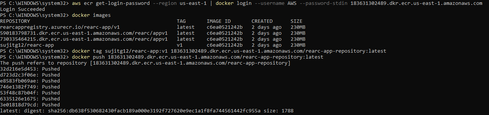
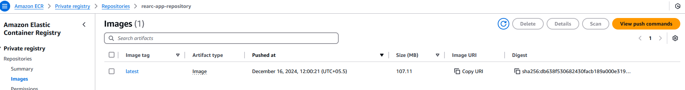
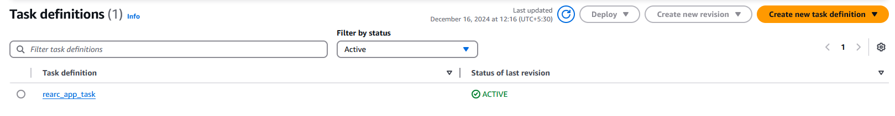
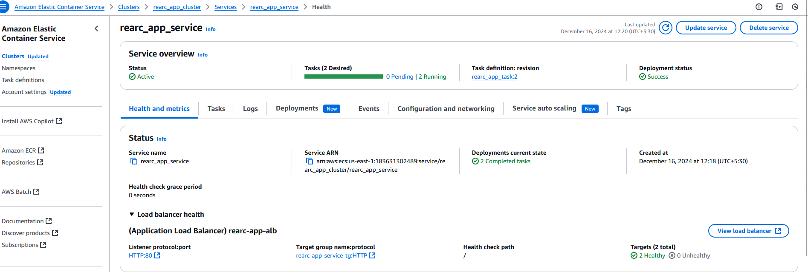
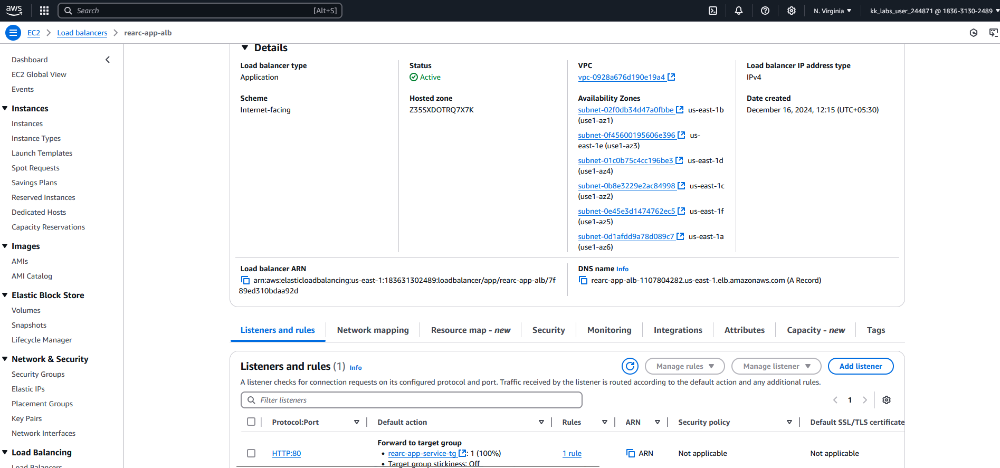
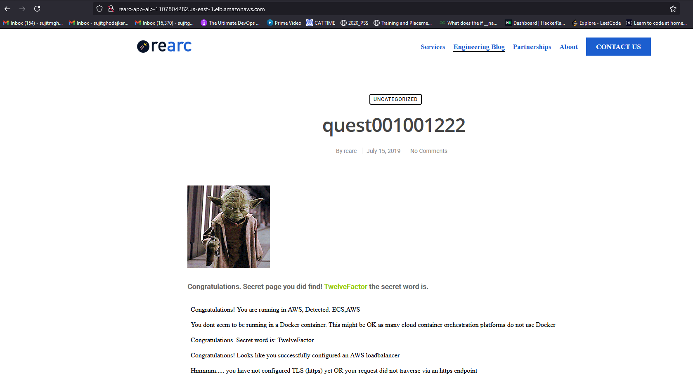

### **Rearc Quest Submission by Sujit Ghodajkar**
I have performed this task in KodeKloud Playgrounds.
---

### **Summary Plan of Action for Deploying the our Node.js Application in AWS**

### **Step 1: Set Up AWS Resources Using Terraform**

1. **Create an S3 Bucket for Terraform State (optional)**
    - Use Terraform to define remote backend for storing the state.
2. **Define Resources in Terraform**:
    - **ECR Repository**: For storing the Docker image.
    - **ECS Cluster**: To host the tasks.
    - **Task Definition**: Specify the container image, environment variables (e.g., `SECRET_WORD`), CPU/memory requirements.
    - **Fargate Service**: Use Fargate to run the task and associate it with an Application Load Balancer (ALB).
    - **ALB**: Configure HTTP listener, target group, and health checks.
    - **Auto-Scaling Group**: Define scaling policies to trigger based on CPU usage >70%.
3. **Network Configuration**:
    - Create a VPC, subnets (public/private), internet gateway, NAT gateway, and security groups.

### **Step 2: Build and Push the Docker Image to ECR**

1. **Login to ECR**
    
2. **Build and Tag the Image**
    
3. **Push the Image**
    

### **Step 3: Deploy the Application Using Terraform**

1. Run Terraform commands:
    
    ```
    terraform init
    terraform plan
    terraform apply
    
    ```
    
2. This creates:
    - ECS Cluster and Service
    - Task Definition (linked to the ECR image)
    - ALB with DNS output
    - Auto-scaling configuration

### **Step 4: Validate the Deployment**

1. Access the application using the ALB DNS name from the Terraform output:
    
    ```
    http://<load_balancer_dns>
    
    ```
    
2. Verify:
    - Index page displays the secret word.
    - `/docker`, `/secret_word`, and `/loadbalanced` endpoints work as expected.

---

### **Below are the steps to deploy the application in AWS**:

## **1. Prerequisites**

Before you begin, ensure you have the following:

- AWS account with appropriate IAM permissions.
- Terraform installed on your local machine.
- Docker installed to build and push the application image.
- Node.js application source code.

---

## **2. Steps to Deploy**

### **Step 1: Create an ECR Repository**

1. Use AWS CLI or the Management Console to create an ECR repository.
    
    ```
    aws ecr create-repository --repository-name <your-app-repo>
    ```
    
2. Authenticate Docker to ECR:
    
    ```
    aws ecr get-login-password --region <region> | docker login --username AWS --password-stdin <account_id>.dkr.ecr.<region>.amazonaws.com
    ```
    
3. Build and push your Docker image:

Use the provided Dockerfile to build the docker image of our Node.js application

    
    ```
    docker build -t <your-app-repo>:latest .
    docker tag <your-app-repo>:latest <account_id>.dkr.ecr.<region>.amazonaws.com/<your-app-repo>:latest
    docker push <account_id>.dkr.ecr.<region>.amazonaws.com/<your-app-repo>:latest
    ```
---



### **Step 2: Write Terraform Configuration for AWS Resources**

### **2.1 Terraform Setup**

1. Create a Terraform working directory:
    
    ```
    mkdir rearc-app-terraform
    cd rearc-app-terraform
    ```
    
2. Initialize Terraform:
    
    ```
    terraform init
    ```
    

### **2.2 Terraform Configuration File**

Write the all the resources names to be created in a `main.tf` files provided in rearc-app-terraform and modules


### **Step 3: Apply Terraform Configuration**

Run the following commands to deploy the resources:

1. Initialize Terraform:
    
    ```
    terraform init
    ```
    
2. Validate the configuration:
    
    ```
    terraform validate
    ```
    
3. Apply the configuration:
    
    ```
    terraform apply
    ```
    
    Confirm the changes to provision the infrastructure.
    

---

resources created in the AWS as below:





### **Step 4: Access the Application**

1. Retrieve the DNS name of the Application Load Balancer from the Terraform output or AWS Management Console.
2. Access the application via the DNS name:
    
    ```
    http://<alb-dns-name>
    ```
    

---

Our application accessible on the web using load-balancer DNS:



3. Cleanup - To avoid incurring costs, delete all resources created:

    ```
    terraform destroy
    ```

---